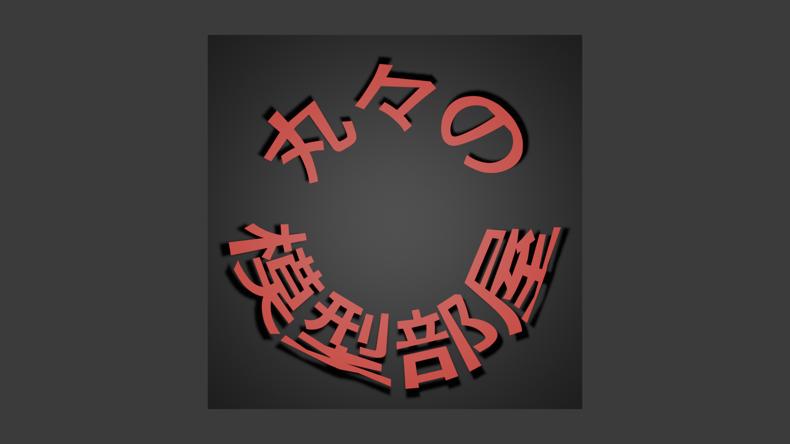
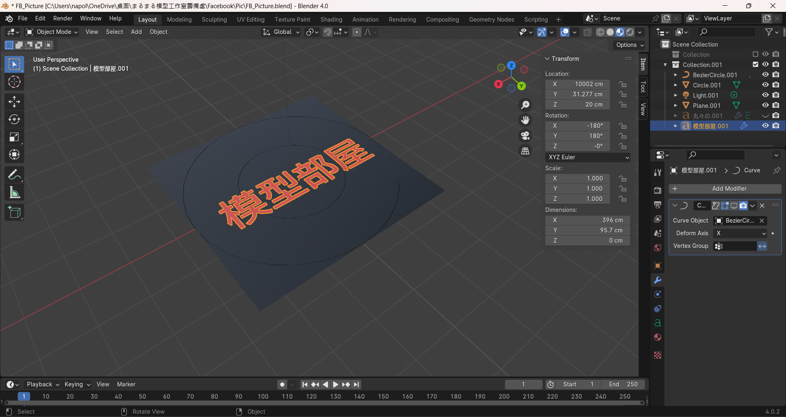
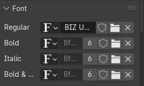
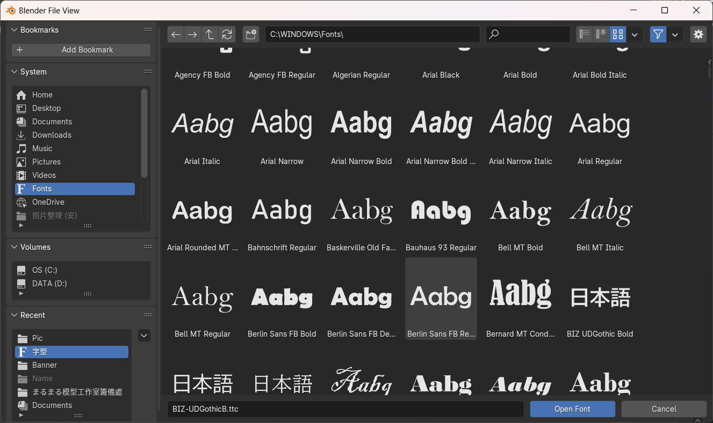
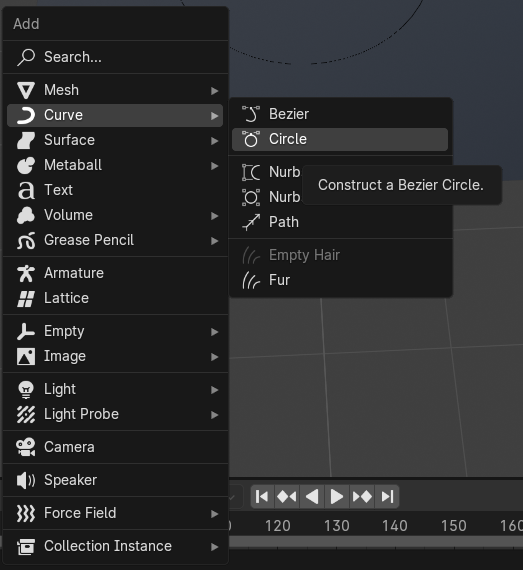
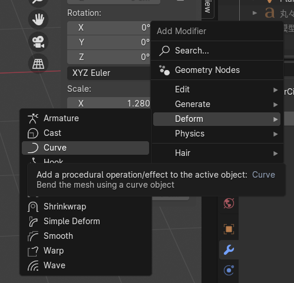
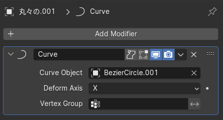
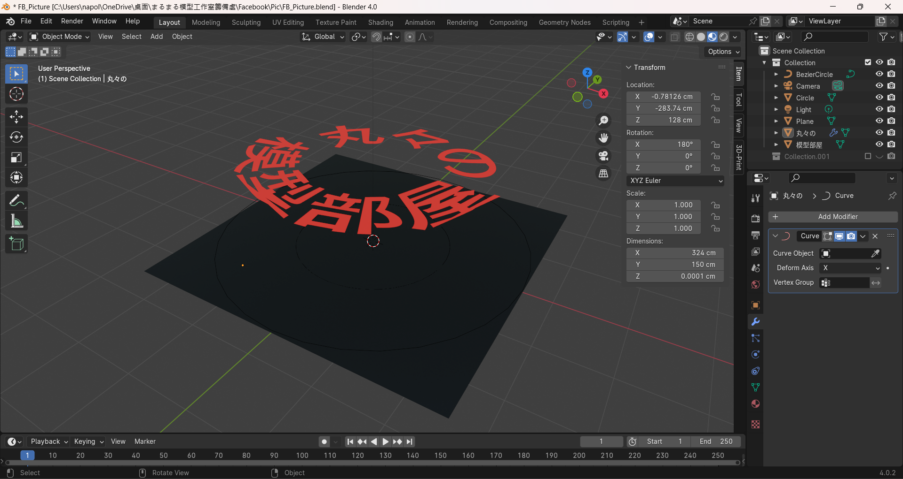

FB_Pic_Design
================
丸々君
2024-04-24

## Introduction

I’d like to show you guys how to design the profile picture on Facebook,
and here we go!

I am using the software called “Blender” to create the profile picture
and banner on FB.

Profile picture are shown as below:

image:

Here are some tips for the design.

1.  Create a 512x512 plane.
2.  Create “Text” items.

image:

If you want to use Chinese or Japanese instead, you need to change
“Font” to the proper language which you like. For example, Japanese.

image:

image:

Here, I create two text items “丸々の”　and “模型部屋.

3.  To bend text items into a circle, you need to create another item
    called “BezierCircle” first.

image:

Then choose the text item, and open the “modifier” panel.

Select the “Deform`\`Curve”

image:

Then select “BezierCircle” in the “Curve Object”.

image:

4.  Almost done, you may adjust position or distance for each items,
    including “light” and “camera”.

When everything is done, press “F12” and output the picture.

image:
